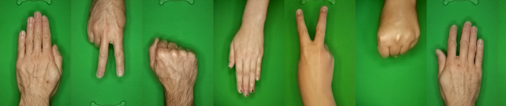

# rps-cv-data-science
Data Science fun using the image dataset from my **rps-cv** project:

**A Rock-Paper-Scissors game using computer vision and machine learning on Raspberry Pi**.

Checkout the **rps-cv** project repository on GitHub at [DrGFreeman/rps-cv](https://github.com/DrGFreeman/rps-cv)



## Notebooks
The following Jupyter notebooks are included in the repository:

### Classification
* [*pca-svm_classifier_skopt.ipynb* ](pca-svm_classifier_skopt.ipynb)  
This notebook shows how to train a Support Vector Machine classifier on the grayscale images using Principal Component Analysis for dimensionality reduction and Bayesian optimization of the model hyperparameters. The model is trained using 75% of the dataset with a five fold cross-validation and achieves a [f1 (micro)](https://scikit-learn.org/stable/modules/generated/sklearn.metrics.f1_score.html#sklearn.metrics.f1_score) score of 97.44% on a test set of 547 images (the remainig 25% of the dataset)

### Visualization/Interpretation
* [pca_visualization.ipynb](pca_visualization.ipynb)  
This notebook presents a visualisation of the Principal Component Analysis (PCA) method used as dimensionality reduction in my **Rock-Paper-Scissors game** project. The objective of the notebook is mainly  to develop an intuition of the meaning of PCA applied to images rather than to present a mathematically rigorous definition of PCA.

## Getting started
To get started, download or clone this repository:
```
$ git clone https://github.com/DrGFreeman/rps-cv-data-science.git
```
Then download and extract the [dataset](#dataset) and install the required [dependencies](#dependencies) as per instructions below.

Once the above steps are completed, launch Jupyter Lab with the command
```
$ jupyter lab
```
or Jupyter notebook with the command
```
$ jupyter notebook
```

## Dataset
The dataset consists of 2188 images of Rock, Paper and Scissors hand gestures captured from the **rps-cv** game. The dataset is relatively well balanced, with 710, 726 and 752 images of the Rock, Paper and Scissors gestures respectively. The images corresponding to each gesture are stored in subdirectories named *rock*, *paper* and *scissors*.

The dataset is released under the Creative Commons Attribution Share-Alike 4.0 license (CC-BY-SA 4.0).

The dataset can be downloaded from the following link: https://www.dropbox.com/s/sr1iui3zfdk0o53/rps-cv-image.zip. The images can then be extracted into the *img* directory of the cloned repository. On Linux, this can be done from the command line:
```
$ cd rps-cv-data-science
$ wget https://www.dropbox.com/s/sr1iui3zfdk0o53/rps-cv-images.zip
$ unzip rps-cv-images.zip -d img/
$ rm rps-cv-images.zip
```

## Dependencies
The Jupyter notebooks in this repository depend on different Python packages. The simplest way to install all the required packages is by using the [Anaconda Distribution](https://www.anaconda.com/distribution/) and the `conda` package manager.

Two environment files are provided to setup conda virtual environments, one base environment for the traditional machine learning tasks using Scikit-Learn, and one for both traditional machine learning using Scikit-Learn and deep-learning using the Keras library and GPU accelerated Tensorflow backend.

To setup an environment with the base libraries use the *environment-base.yml* environment file:
```
$ conda env create -f environment-base.yml
```
This will create an environment named *rps-cv* that can be activated with the command
```
$ conda activate rps-cv
```

To setup an environment for deep-learning using Keras, use the *environment-keras-gpu.yml* environment file:
```
$ conda env create -f environment-keras-gpu.yml
```
This will create an environment named *rps-cv-keras* that can be activated with the command
```
$ conda activate rps-cv-keras
```
Note that this second environment installs the GPU accelerated versions of Keras and the Tensorflow backend. This will only work if your computer is equipped with a Cuda compatible Nvidia GPU. Running the artificial neural network notebooks from this repository is intractable on a CPU.

### Managing conda environments within Jupyter Lab/Notebook
To allow changing the conda environments from within Jupyter Lab or Jupyter Notebook, install the `nb_conda` package in the *base* conda environment:
```
(base) $ conda install nb_conda
```
Jupyter Lab or Jupyter Notebook can then be launched from the *base* environment and the desired kernel (conda environment) selected within Jupyter.
